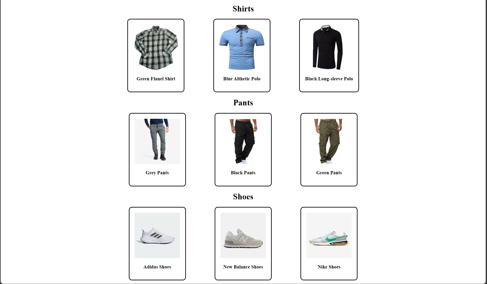

# Selectors, Webpage Box Model

## Assignment: Clothing Catalog

For this assignment you will create a page to display clothing items for a store.

### Instructions
  - You may not use ANY [inline css](https://www.geeksforgeeks.org/inline-css/) for this assignment. All styling must be done in a [seperate css file which has already been created for you.](./index.css)
    - Link the stylesheet (index.css) to the html file (index.html)- Add a link tag to the top of the html file inside the head tag
      - Change value of the 'href' attribute on the link tag to a file-path of the stylesheet.
  
**Part 1: Align the clothing items horizontally**
  - Align the clothing items horizontally on the page
    - Change the [display](https://www.w3schools.com/Css/css_display_visibility.asp) CSS property on the clothing item dividers (divs) to '[inline-block](https://www.w3schools.com/Css/css_inline-block.asp)' to allow them to render without line-breaks.
      - Create a style-block in the stylesheet ([index.css](./index.css)) that targets the .item class and set the value of the 'display' property to be 'inline-block'

**Part 2: Space-out and center the clothing items**
  - Create some space between the clothing items so they arent so close together.
    - Configure [the stylesheet](./index.css) to apply a 3% margin on the left-side and right-side of all elements with the .item class
  
  - Space the clothing items evenly across the screen.
    - Change the container elements for the clothing items into flexboxes and set the content to be centered
      - Configure [the stylesheet](./index.css) to apply a 3% margin on the left-side and right-side of all elements with the .item class

**Part 3: Center the item descriptions and category headers**
  - Center the category headers of Shirts, Pants and Shoes to the middle of the page.
    - Configure [the stylesheet](./index.css) to center all text within the elements containing the headers for the categories.
      - Create a style-block in the stylesheet ([index.css](./index.css)) that targets all the elements containing the headers for the categories and set the value of the 'text-align' property to be 'center'
  
  - Center the item descriptions for each of the clothing items. DO NOT USE INLINE CSS
    - You got this! 😊 (Hint: Consider adding a class definition to the HTML elements that contain the text for the descriptions)

**Part 4: Add padding to the item containers, Round the borders of item containers** 
  - Add some internal padding to all the elements that contain the item image and description
    - Configure [the stylesheet](./index.css) to apply a 10px padding to all of the elements with the .item class
  
  - Round the corners of the borders for the item containers
    - Configure [the stylesheet](./index.css) to apply a border-radius of 12px to all of the elements with the .item class

  

Take a look at Example.png for an idea of how the end result should look.
